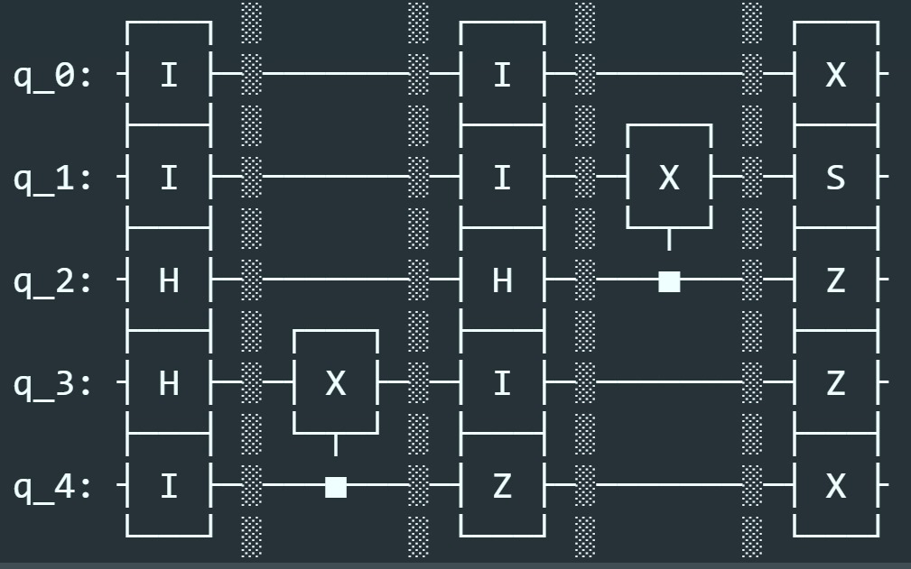
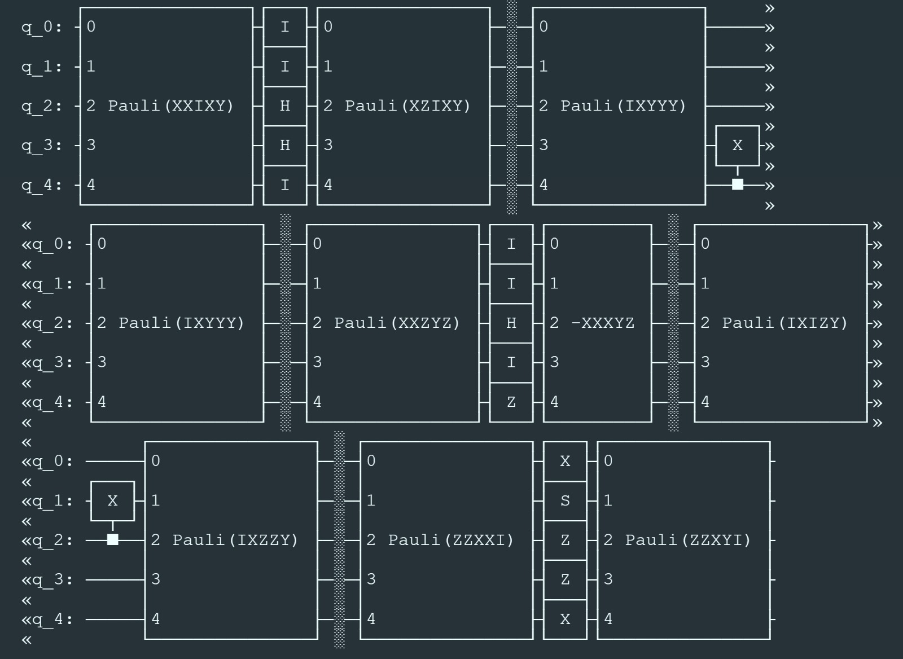
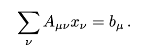

# ACES

Through this project, we attempted to implement the method for scalable noise metrology of quantum circuits that improves upon randomized benchmarking, interleaved RB and simulataneous RB. The theory behind ACES is linked here: [Averaged circuit eigenvalue sampling](https://arxiv.org/pdf/2108.05803.pdf) is developed by Steven T. Flammia.

##### General Problem:

The error rates of a general Pauli channel can be reinterpreted by examining the error rates of the Pauli-twirl of that channel.

##### Method:

1) Generate a random noisy circuit.
   ``generateCliffordCircuit``: generate a random Clifford circuit with single and double qubit gates. This function takes the single and double qubit Clifford gate sets as the input. Then it randomly generate a ``qiskit`` circuit with single and double qubit gates layer by layer.
2) Twirl the generated circuit: We take the following inputted quantum circuit, and output the next quantum circuit that includes the Pauli Twirling gates.

   
   
3) Generate the "A" matrix: To continue, we build a matrix A, constructed to build to full rank. Each row in matrix A represents in independent sampling of the quauntum circuit, meant to capture the frequency of errors for each operation on each Pauli input. We solve the following equation to fully describe the linear system of the circuit.

   
4) Solve the "A" matrix for Pauli Error rates: Given a matrix A, we solve the equation Ax=b for x, where x corresponds to the Pauli eigenvalues of the twirled channel.
5) From Lambda to Error Probabilities: We take the eigenvalues of the individual gates and Hadamard transform them to find the probability of an errors for a general Pauli Channel at the each gate level.

##### Current Bugs:

1) Error Probability Discovery: For simplicity, we previously unincluded the identity transform in our single qubit operations, later realizing that in order to incorporate the hadamard transform, we do require it in the Single Gate input set. Hence a simple solution to solving the error probability bug is to include the Identity gate, and then accordingly update the params_list to include the Identity gate as well. We reccomend future for rectifcation of this bug is defining a consistent mapping or reference from tuples of clifford gates and pauli errors to some index. We believe that a slight change in convention with how this mapping is done is the source of the error in the final conversion from the Pauli eigenvalues to the associated Pauli errors of the general channel of interest.
2) 

##### Integration with Horizon Quantum Computing:

1) Built QPU script: We've developed a method of delivering the relevant QASM circuit object from python into HQC's compiler via the API. We have developed a test for this implementation and successfully compiled from the current highest layer, Helium, which is similar to C, down to the gate level language, Hydrogen, then generated the relevant API. Note: the max_num_qubits and total are not dynamic variables.
2) Deployment on AWS Quantum Simulator: We'd tested the API via Postman, and currently can query the task successfully. On the AWS side, the current script fails and we believe this is due to the indexing of how we're assigning qubits. To reproduce this error, the final 3 gates in the current code, will produce an X-gate on the same qubit, incorrectly.
3) Deployment on IonQ Quantum Computer: Notably, due to the nature of error characterization, the specific quantum hardware that this is deployed on can drastically impact the usefulness and output of the algorithm proposed. In a semi-conducting qubit setting, the ACES protocol is particularly helpful due to the spatial specificity of the error characterization at the gate level. For other quantum hardware regimes, gate level error characterization can help towards the development of fault-tolerant algorithms in error mitigation.
